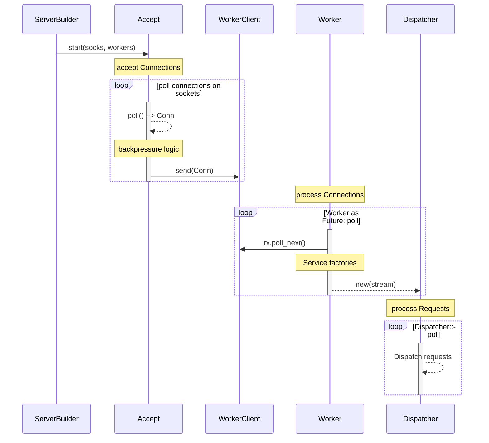
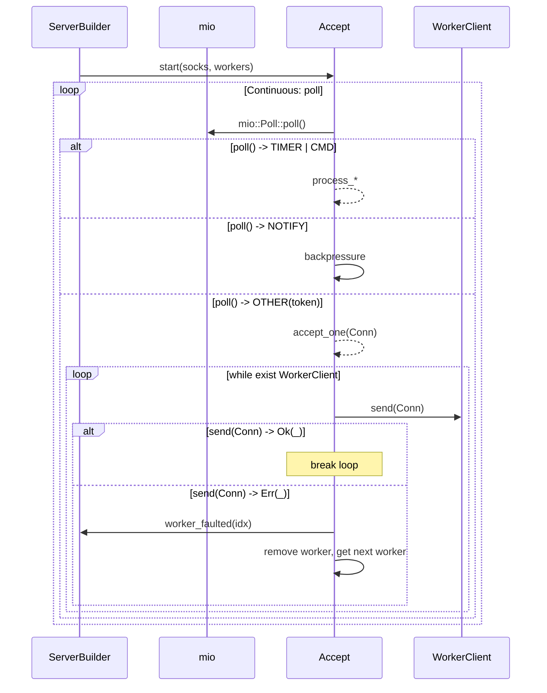
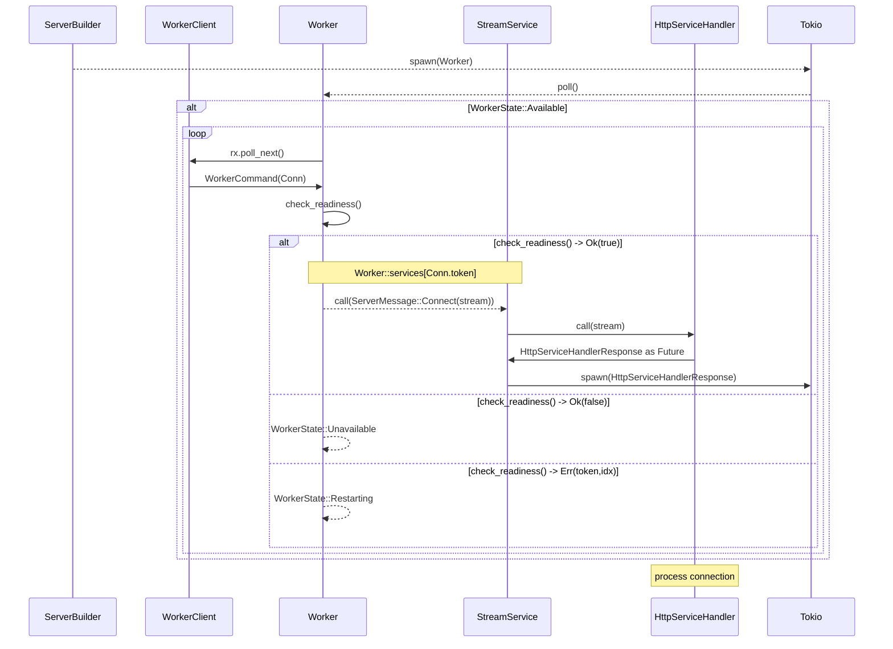
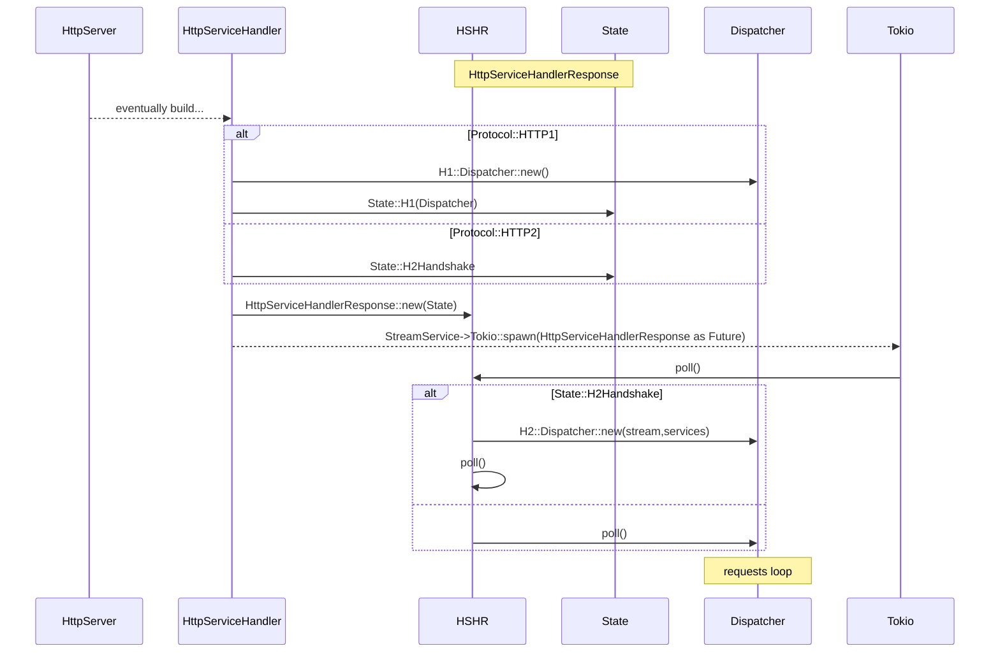

**Source URL**: https://actix.rs/docs/conn_lifecycle

> 본 파일은 actix.rs 다이어그램 페이지를 GitHub 원본 + mermaid `.mmd` 소스로 재구성한 verbatim 캡처다. 렌더 SVG 대신 mermaid 소스를 보존한다.

# Architecture overview

After Server has started listening to all sockets, [`Accept`][accept] and [`Worker`][worker] are two main loops responsible for processing incoming client connections.

Once connection accepted Application level protocol processing happens in a protocol specific [`Dispatcher`][dispatcher] loop spawned from [`Worker`][worker].

    Please note, below diagrams are outlining happy-path scenarios only.

## Accept loop in more detail

Most of code implementation resides in [`actix-server`][server] crate for struct [`Accept`][accept].

## Worker loop in more detail

Most of code implementation resides in [`actix-server`][server] crate for struct [`Worker`][worker].

## Request loop roughly

Most of code implementation for request loop resides in [`actix-web`][web] and [`actix-http`][http] crates.

[server]: https://crates.io/crates/actix-server
[web]: https://crates.io/crates/actix-web
[http]: https://crates.io/crates/actix-http
[accept]: https://github.com/actix/actix-net/blob/master/actix-server/src/accept.rs
[worker]: https://github.com/actix/actix-net/blob/master/actix-server/src/worker.rs
[dispatcher]: https://github.com/actix/actix-web/blob/master/actix-http/src/h1/dispatcher.rs
