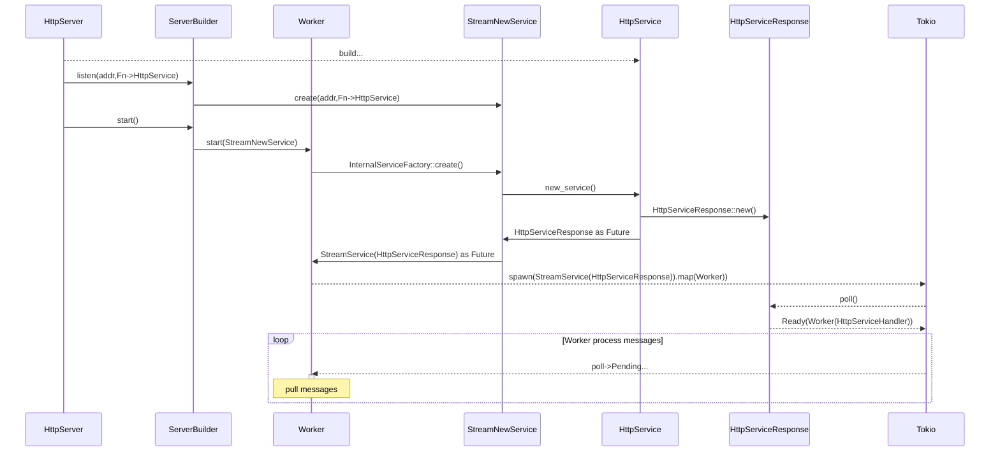

**Source URL**: https://actix.rs/docs/http_server_init

> 본 파일은 actix.rs 다이어그램 페이지를 GitHub 원본 + mermaid `.mmd` 소스로 재구성한 verbatim 캡처다. 렌더 SVG 대신 mermaid 소스를 보존한다.

# Architecture overview

Below is a diagram of HttpServer initialization, which happens on the following code

```rust
#[actix_web::main]
async fn main() -> std::io::Result<()> {
    HttpServer::new(|| {
        App::new()
            .route("/", web::to(|| HttpResponse::Ok()))
    })
    .bind(("127.0.0.1", 8080))?
    .run()
    .await
}
```


