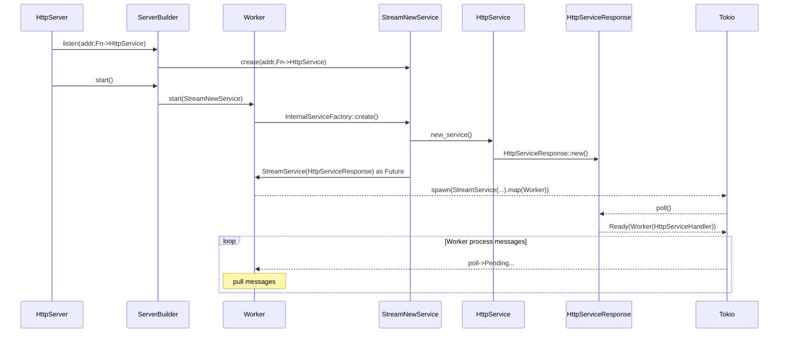
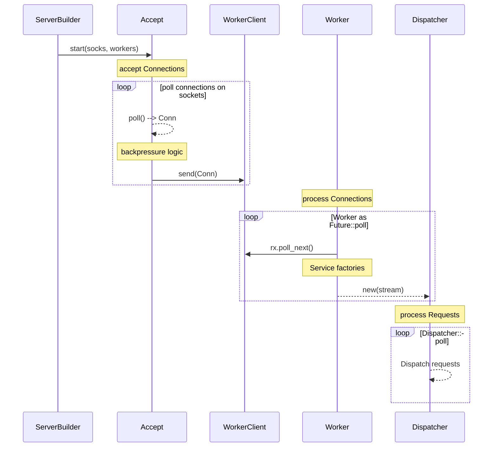

요청 한 건이 [[actix-web]] 서버 내부에서 흐르는 경로를 다룬다. 크게 **초기화**(ServerBuilder → Worker → StreamNewService → HttpService), **Accept 루프**(소켓 수락 + backpressure), **Worker 루프**(연결 분배), 그리고 프로토콜별 **Dispatcher 루프**(H1/H2)로 나뉜다. 대부분의 구현은 `actix-server`·`actix-http` crate에 있고, [[tokio]] 런타임 위에서 모든 루프가 future로 폴링된다. 운영·튜닝 관점은 [[actix-web-http-server]] 참조.

## 1. 초기화 — App 팩토리가 서비스가 되기까지

`HttpServer::new(factory).bind(..).run()`를 호출하면, `ServerBuilder`가 리스너를 등록하고 `Worker`를 기동한다. 각 워커는 `StreamNewService → HttpService → HttpServiceResponse` 체인을 future로 만들어 [[tokio]]에 spawn하고, 준비가 끝나면 `HttpServiceHandler`를 보유한 워커가 된다.

*캡션:* 서비스 팩토리가 워커마다 한 번씩 인스턴스화되므로, **워커 수 = App 복제본 수**다. 이것이 워커 간 상태가 공유되지 않는 이유이며([[actix-web-application-state]]), `workers()` 값이 메모리·동시성에 직접 영향을 준다.

## 2. Accept 루프 + Worker 루프

서버가 모든 소켓을 listen하기 시작하면 **Accept**와 **Worker** 두 루프가 클라이언트 연결을 처리한다. Accept는 `mio::Poll`로 소켓을 폴링해 연결을 수락하고, 사용 가능한 `WorkerClient` 채널로 연결을 분배한다. 워커는 자기 채널을 폴링해 받은 연결마다 `Dispatcher`를 생성한다.

*캡션:* Accept 루프의 **backpressure 로직**이 핵심이다. 워커가 포화되면(`send(Conn)`이 실패하면) Accept는 해당 워커를 결함으로 표시하고 다음 워커로 넘기거나, NOTIFY를 받아 새 연결 수락을 잠시 멈춘다. 즉 **워커 수가 동시 처리 상한**을 정하고, 워커가 블로킹되면(→ [[actix-web-http-server]]의 블로킹 금지 경고) Accept가 backpressure를 걸어 전체 처리량이 떨어진다.

## 3. 프로토콜 Dispatcher (H1/H2)

연결을 받은 워커는 프로토콜에 따라 상태를 갈라 `HttpServiceHandlerResponse(HSHR)`를 [[tokio]]에 spawn한다. **HTTP/1**은 곧바로 `H1::Dispatcher`를, **HTTP/2**는 먼저 `H2Handshake`를 거친 뒤 `H2::Dispatcher`를 만든다. 이후 Dispatcher가 요청 루프를 돌며 핸들러를 호출한다.

- **H1 Dispatcher**: 연결 위에서 요청을 순차 처리. keep-alive가 켜져 있으면 같은 연결로 다음 요청을 기다린다 → keepalive timeout이 길수록 연결이 워커 슬롯을 오래 점유한다.
- **H2 Dispatcher**: 멀티플렉싱된 스트림을 처리. 핸드셰이크 후 한 연결에서 여러 요청이 동시에 흐른다.

요청 루프 구현은 `actix-web`·`actix-http` crate에 있다. 핸들러가 실제로 받는 추출/응답 단계는 [[actix-web-extractors]] · [[actix-web-handlers-responders]]를 참조.

## 성능 관점 요약

| 파라미터 | 내부 영향 |
|----------|-----------|
| **워커 수** (`workers()`) | App 복제본 수 = 동시 처리 상한. 너무 적으면 Accept backpressure로 throughput 저하, 너무 많으면 메모리·컨텍스트 스위치 증가 |
| **keep-alive timeout** | H1 Dispatcher가 연결을 닫지 않고 대기 → 슬롯 점유. 짧으면 재연결 비용↑, 길면 idle 연결이 자원 점유 |
| **backpressure** | Accept가 포화 워커에 연결을 못 보내면 수락 자체를 늦춤 → 핸들러 블로킹이 시스템 전체로 전파되는 경로 |

## References

- [[actix-web-http-server]] — 운영·튜닝(워커 수, keep-alive, graceful shutdown)
- [[actix-web-application-state]] — 워커별 App 복제본과 공유 상태
- [[actix-web-handlers-responders]] · [[actix-web-extractors]] — Dispatcher가 호출하는 요청 처리 단계
- [[tokio]] — 모든 루프를 폴링하는 비동기 런타임
- [[actix-web-official-docs]] — HTTP Server Initialization / Connection Lifecycle 다이어그램
